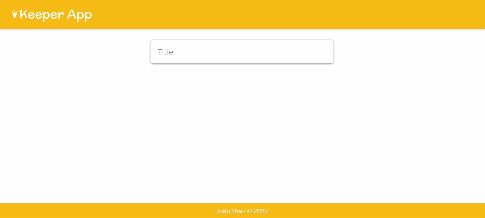

# **Keeper App**



Keeper is an app to create quick notes and built with ReactJS.

## **Contents**

- [Overview](#overview)
- [My process](#my-process)
- [What I learned](#what-i-learned)
- [Next steps](#next-steps)
- [References](#useful-resources)

## **Overview**

This app was built in the Angela's course - Web Development Full Course - on Udemy. It was a good starting point of my studies about React library.

## **My process**

To begin this project I had to make a couple of another small projects to understand React's concepts. So, If you're interested you can check some of these on my profile at the [codesandbox.io](https://codesandbox.io/u/JoaoVSBraz).


One thing that you may realize is that some files have a lot of comments explaining all things that happens. Being a study project I think it's a good practice to document all the process to consult sometime in the future.

This app uses a few elements provided by the Material UI library which has a bunch of pre-built components to use on React, but the majority of elements used was some icons.

To conclude, one effort that I definitely done throughout all the course was how to search and consult documentations.

## **What I learned**

Being my first contact with ReactJS and last project at the course, I've learned several concepts about this library like it's components, JSX, props and react hooks such useState.

Example
```jsx
import { useState } from "react"

const [notes, setNotes] = useState([])
```

The useState() is a function used to manage the state of a component. It has two parameters where the first is a variable and the second is another function which update the variable content when its changed. The example above, uses destructuring of ES6 to extract this two parameters.

Maybe the most important thing that I've learned was to consult documentations. Teacher Angela really encourage her students to make your own searches and learn something just by yourself.

## **Next steps**

This is a project that I want to revisit sometime to improve it. The next step will be to provide it online, so you'll can write your own notes.

## **References**

- [React Documentation](https://reactjs.org/)
- [CodeSandbox](https://codesandbox.io/)
- [Material UI](https://mui.com/)
- [Hire me](https://www.linkedin.com/in/joaovsbraz/)